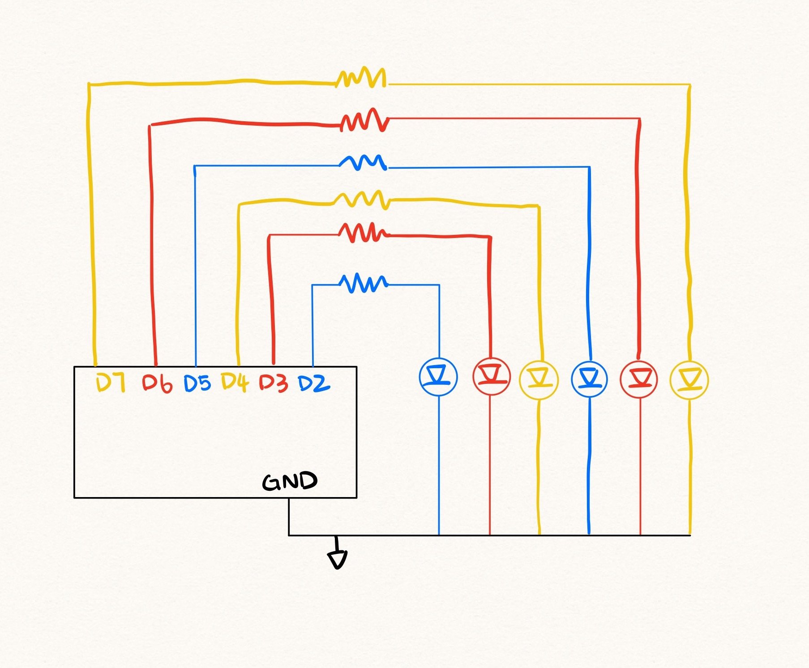

 1. Description of how you encoded seconds into lights.  
 I set up six LED lights where each LED represents 10 seconds. Each LED blinks every second, and after 10 seconds, it stays on to show that 10 seconds have passed. When all six LEDs are on, it means 60 seconds have gone by. The sequence then resets and starts again, repeating every 60 seconds.  

 2. A schematic drawing of your circuit.  
 
 
